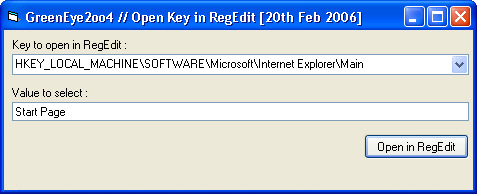

## Jump to Regedit

### Description

Opens a registry key and selects a value in RegEdit.exe (Windows Registry Editor), even if RegEdit is already running. Please vote!
 
### More Info
 
Registry Key to open, regisry value to select

             |
---                |---
**Submitted On**   |2006-02-20 00:16:36
**By**             |[Jondlar](https://github.com/Planet-Source-Code/PSCIndex/blob/master/ByAuthor/jondlar.md)
**Level**          |Advanced
**User Rating**    |4.8 (19 globes from 4 users)
**Compatibility**  |VB 6\.0
**Category**       |[Registry](https://github.com/Planet-Source-Code/PSCIndex/blob/master/ByCategory/registry__1-36.md)
**World**          |[Visual Basic](https://github.com/Planet-Source-Code/PSCIndex/blob/master/ByWorld/visual-basic.md)
**Archive File**   |[Jump\_to\_Re1974942202006\.zip](https://github.com/Planet-Source-Code/jondlar-jump-to-regedit__1-64392/archive/master.zip)

### API Declarations

See Code

